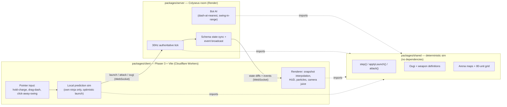

# Ougi Arena

A real-time multiplayer browser brawler inspired by the classic slingshot ninja game *Nindou*. Chibi ninjas slingshot-dash and swing melee weapons around a destructible arena in 2-minute free-for-all matches, charging their ultimate move — their **Ougi** — by dealing damage.

**▶ Play now:** https://ougi-arena.j-desolate53.workers.dev
*(Server is on a free tier and sleeps after ~15 min idle — first join can take 30–60s while it wakes up; the client shows a "waking the dojo…" loading state instead of hanging.)*

> **Status: shipped, through the M8 visual overhaul.** Rooms, bots, 3 arenas, 3 Ougis and 3 weapons all work end to end, deployed for $0/month. See [docs/mvp-plan.md](docs/mvp-plan.md) and [docs/m8-plan.md](docs/m8-plan.md) for the full build history, and [docs/prd.md](docs/prd.md) for what's next.

## What it is

- **2–4 player free-for-all** — hit Quick Play, share a room link, or pick from the public room list. No accounts, no installs, just a URL.
- **Always playable:** AI bots fill empty slots, so a solo visitor gets a real match immediately.
- **Drag-to-dash movement:** grab your ninja, drag toward where you want to land, release to launch. Dashes cost TP and land exactly on the tile you aimed at; a dash through an enemy shatters them instantly.
- **Melee weapons:** every ninja also carries a kunai, paper fan, or longsword — click away from yourself to swing in that direction. Weapons chip HP on a cooldown; only a dash instantly kills, so the two systems pressure each other instead of one making the other pointless.
- **Destructible, tile-based arenas:** three hand-authored maps (dense pillar chokes, corner hay pockets, one open field) built on an 80-unit grid — dashes and weapon swings both resolve to exact tiles.
- **3 Ougis:** each character's ultimate charges from damage dealt — an instant radial shockwave, a 5-second mobility surge, or four cardinal beams that shatter anyone caught in a lane.
- **2-minute matches:** most KOs at the bell wins; sudden death on ties.
- **Seamless:** drop your wifi mid-match and rejoin the same game; aim feels instant at real-world latency thanks to optimistic local launch.

## Why it exists

*Nindou* was a wonderful, chaotic little browser game that no longer exists. Ougi Arena is a love letter to it — built first and foremost to be *fun*: quick to join, satisfying to play, and free to run so anyone can be invited.

Under the hood it still has an interesting engine: a hand-rolled deterministic fixed-timestep simulation shared verbatim between server and client, run authoritatively inside Colyseus rooms at 30Hz, with local-first aiming, optimistic dash launches, snapshot interpolation, and seamless mid-match reconnection.

## Architecture

One TypeScript sim, shared byte-for-byte between an authoritative server and an optimistic client:



- **`packages/shared`** owns the entire simulation — physics, collision, HP/TP/SP rules, Ougi and weapon effects, map data — as pure, dependency-free functions. Nothing here knows it's running on a server or a client.
- **`packages/server`** runs that sim authoritatively inside a Colyseus room at a fixed 30Hz, feeding it real player input plus bot decisions, and syncs the result out via `@colyseus/schema` plus a side-channel of discrete events (KOs, hits, Ougi fires) the client can't derive from state diffs alone.
- **`packages/client`** renders the authoritative state with ~100ms snapshot interpolation for everyone else's ninja, while running a second, local-only copy of the same sim for *your* ninja so a dash starts at 0ms instead of waiting a round trip — reconciling to the server only once you're at rest, so a correction never interrupts a live dash.

Full rewind-replay prediction was considered and deliberately skipped (see `docs/mvp-plan.md`'s S9 verdict): because both sims run the identical deterministic step, an uncontested dash needs no replay at all — the only artifact found at 200ms simulated RTT was a reconciliation-timing bug, not a prediction gap.

## Tech stack

| Layer | Choice |
|-------|--------|
| Language | TypeScript (strict), pnpm monorepo: `shared` / `server` / `client` |
| Multiplayer server | Node.js + [Colyseus](https://colyseus.io) — rooms, state sync, matchmaking, reconnection |
| Client | [Phaser 3](https://phaser.io) + Vite — rendering, input, audio, particles, juice |
| Simulation | Custom deterministic fixed-timestep sim in `shared` (impulse, collision, HP/TP/SP, Ougi/weapon effects) |
| Hosting | Server on Render (free tier), client on Cloudflare Workers static assets (free) — $0/month |

## Development

```bash
pnpm install
pnpm dev        # client (Vite) + Colyseus server with hot reload
pnpm test       # simulation unit tests (109, packages/shared)
pnpm typecheck && pnpm lint
```

No env vars are needed locally: the client falls back to `ws://localhost:2567` and the server allows any origin. For deployment — Render + Cloudflare, and the two env vars that connect them — see [docs/deploy.md](docs/deploy.md).

## Roadmap

**MVP — shipped** (see [docs/mvp-plan.md](docs/mvp-plan.md) for the full session-by-session build log):

1. **M1** — Local sim + Phaser client, playable solo
2. **M2** — Colyseus rooms, authoritative server, interpolation + optimistic launch, reconnection
3. **M3** — Match rules, TP/SP, character select, 3 Ougis
4. **M4** — Bots + practice mode, Quick Play, public room list, latency feel pass
5. **M5** — Juice + art/audio pass, character select screen
6. **M6** — Drag-toward movement, nameplates, 80-unit arena grid with cell-snapped dashes, 3 authored maps, weapon system + 3 weapons
7. **M7** — Free-tier deploy (Render + Cloudflare), mobile-lite pass, production smoke test, README + this architecture writeup

**M8 — visual/UX overhaul** (shipped; see [docs/m8-plan.md](docs/m8-plan.md)): a design-token system realigned to the logo's ember-vs-ice arcade look, an arcade HUD with HP/TP/SP gauges, arena faux-depth (tall pillars, cast shadows, textured floor), per-weapon and per-Ougi attack animations with hit feedback, a match-start countdown that teaches the controls, and pause/quit game-loop controls.

**Post-MVP** (see [docs/prd.md](docs/prd.md) for the full PRD and roadmap):

- Rewind-replay prediction, if a real-world latency pass ever demands it; a proper mobile pass
- *Save the Princess* 2v2 objective mode, more characters/weapons/maps, smarter bots
- If it finds players: always-on hosting, accounts, stats, replays, moderation

## Credits & legal

Inspired by *Nindou*, a browser game fondly remembered and long gone. Ougi Arena contains no Nindou assets, names, or artwork — all art and audio are original, licensed, or CC0 (see [docs/asset-credits.md](docs/asset-credits.md)).
